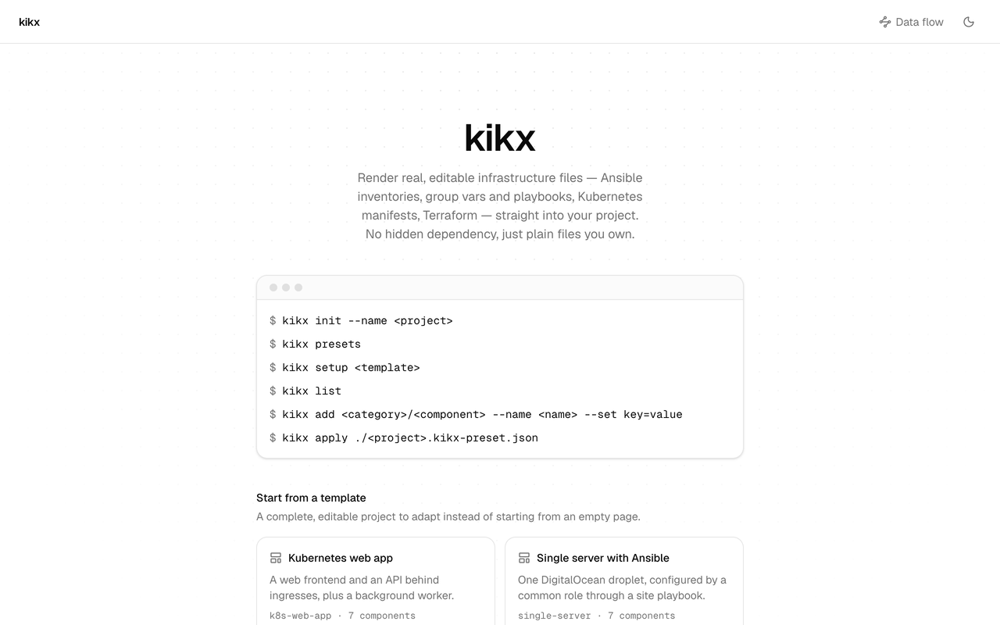
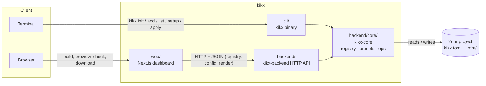

<div align="center">

# kikx

**Vendor real, editable infrastructure files straight into your project.**

Ansible inventories, group vars, playbooks and roles, Kubernetes manifests and Terraform
resources, rendered from a template and written as *actual files* you own. No hidden dependency,
no runtime package to upgrade, no black box to debug later.

[](cli)
[](web)
[](backend/core/templates/ansible)
[](backend/core/templates/k8s)
[](backend/core/templates/terraform)

</div>

---

Instead of installing a hidden dependency or generating output you have to trust blindly, `kikx`
renders a template with the values you gave it and writes the result into your project: plain
files sitting next to your other code. Edit them, delete them, check them into git like anything
else. There's no registry lock-in and no generated-code comment telling you not to touch the file.

<p align="center">
  
</p>

<picture>
  <source media="(prefers-color-scheme: dark)" srcset="docs/source/images/builder-dark.png">
  
</picture>

<sub>The builder with the <a href="backend/core/presets/multi-tier-platform.kikx-preset.json">multi-tier-platform template</a>
loaded: 35 components, 77 files. Stages on the left, the editor in the middle, the project on the right.</sub>

## Documentation

Full documentation lives in `docs/`, organised with [Diátaxis](https://diataxis.fr): tutorials, how-to
guides, reference and explanation. It is built with Sphinx and the Furo theme, the same toolchain as
the Diátaxis site. The source pages are in English, starting at [docs/source/index.md](docs/source/index.md).
The French translation lives in gettext catalogues under `docs/locales/fr/`, managed with sphinx-intl.

## Table of contents

- [Documentation](#documentation)
- [Concept](#concept)
- [Quick start](#quick-start)
- [Start from a template](#start-from-a-template)
- [Available components](#available-components)
- [The dashboard](#the-dashboard)
- [Architecture diagram](#architecture-diagram)
- [Presets: setup vs. apply](#presets-setup-vs-apply)
- [Configuration](#configuration)
- [How it fits together](#how-it-fits-together)
- [Backend API](#backend-api)
- [Development](#development)
- [Current scope](#current-scope)

## Concept

A `kikx` project is a directory with a `kikx.toml` (project name, default namespace, output
folder) and the files kikx vendored for you:

```
my-platform/
├── kikx.toml
└── infra/
    ├── platform-inventory.ini
    ├── group_vars/
    │   ├── all/main.yml
    │   └── db.yml
    ├── playbooks/
    │   ├── bootstrap.yml
    │   └── data.yml
    ├── roles/postgres/{tasks,defaults,handlers,meta}/main.yml
    ├── site.yml
    ├── api-deployment.yaml
    └── api-service.yaml
```

`kikx add k8s/deployment --name api --set image=ghcr.io/acme/api:1.0` renders the `deployment`
template with the values you gave it, fills in the registry's defaults for anything you didn't,
and writes `api-deployment.yaml`. Run it again with `--force` to re-render and overwrite. That's
the whole model.

## Quick start

### CLI

```bash
cd your-project
kikx init --name my-platform --dir infra
kikx list
kikx add k8s/deployment --name api --set image=ghcr.io/acme/api:1.0 --replicas 3
kikx add k8s/service    --name api
kikx add ansible/role   --name postgres
```

`init` and `add` refuse to clobber an existing file unless you pass `--force`. A Deployment's pod
label and a Service's selector both default to `app: <name>`, so a deployment and a service with
the same `--name` target each other out of the box.

### Dashboard

```bash
cp backend/.env.example backend/.env
cp web/.env.example web/.env.local

cd backend && cargo run &
cd web && npm install && npm run dev
```

Open `http://localhost:3000`, give your project a name, and start adding components, or open a
preset you downloaded earlier.

## Start from a template

kikx ships ready-made preset templates. List them with `kikx presets`, or pick one on the
dashboard's home page under "Start from a template".

| Template | What you get |
|---|---|
| `k8s-web-app` | A frontend and an API behind ingresses, plus a background worker |
| `single-server` | One DigitalOcean droplet configured by Ansible: inventory, common role, playbook, site |
| `kubeadm-cluster` | Hetzner servers bootstrapped into a three-node control plane and three workers |
| `web-and-database` | Existing servers split into a web tier and a PostgreSQL primary with a replica |
| `multi-tier-platform` | Load balancers, web and app tiers, PostgreSQL, Redis, monitoring and a Kubernetes cluster |

```bash
mkdir demo && cd demo
kikx setup multi-tier-platform
```

The largest one writes 77 files:
- a Terraform resource;
- a 13-group inventory with nested `:children` and shared `:vars`, and an `ansible.cfg`;
- four `group_vars` files;
- six playbooks, with 10 plays between them;
- a `site.yml` that imports them in order;
- 14 roles;
- 7 Kubernetes manifests.

From the output folder, the inventory resolves with `ansible-inventory --graph` and `site.yml`
passes `ansible-playbook --syntax-check` (the common role uses `community.general`). Templates are
ordinary presets in [`backend/core/presets/`](backend/core/presets), so they are a good starting
point for writing your own.

## Available components

Every component is `<category>/<name>` and resolves through the same registry, whether you use the
CLI, the HTTP API or the dashboard. The registry is also where each field's default, example and
allowed choices live, so no client repeats them.

| Reference | What it renders |
|---|---|
| `ansible/inventory` | An `.ini` inventory. Hosts can sit in several groups; groups can nest with `:children` and share vars with `:vars` |
| `ansible/group-vars` | `group_vars/<group>.yml` or `group_vars/<group>/main.yml`, as key/value pairs or raw YAML |
| `ansible/playbook` | A playbook with one or more plays, each with its group, ordered roles, per-role `when:`, tags, `become`, and `pre_tasks`/`post_tasks` |
| `ansible/site` | `site.yml`, which imports your playbooks in run order |
| `ansible/role` | An empty role skeleton (`tasks`, `defaults`, `handlers`, `meta`) to fill in |
| `ansible/common-role` | A starter host-hygiene role: base packages, timezone, swap, a templated motd |
| `ansible/k8s-bootstrap` | A playbook installing containerd, kubelet, kubeadm and kubectl |
| `k8s/deployment` · `k8s/service` · `k8s/ingress` | Kubernetes manifests |
| `terraform/hetzner` · `terraform/digitalocean` | One or more cloud servers |

Point the dashboard's "From registry URL" entry, or `kikx add <url-or-path>`, at any
`registry-item.json` (local file or URL) to render something that isn't built in. No kikx update
required.

## The dashboard

- **Stages, in order.** Components are grouped as Provision → Inventory → Configure → Deploy, with
  a count and a tick per stage, so you can see what's still missing.
- **One editor with a live preview.** Output re-renders as you type. Any component can be reopened
  and edited, removes can be undone, and ⌘/Ctrl+Enter saves.
- **Bring what you have.** Import an existing `inventory.ini` (hosts listed in several groups are
  merged), paste raw YAML into group vars, reopen a saved preset, or type role names that already
  exist in your repo.
- **Conflicts are caught, not written.** A project can't have two writers for one file. The
  conflict dialog shows who owns the file and a side-by-side diff before replacing. The Checks
  view cross-checks components for:
  - a host with two addresses
  - a host var silently overriding a group var
  - a key set in both group_vars and the inventory
  - plays aimed at groups that don't exist
  - `:children` cycles
  - `site.yml` importing a missing playbook
  - a Service or Ingress pointing at nothing
  - roles the project doesn't vendor, with one-click scaffolding
- **Nothing touches disk until you download.** The project lives in the browser tab. Download it
  as a `.zip`, or as a preset for `kikx setup` / `kikx apply`.

## Architecture diagram

The Architecture view is drawn from what you've added, not a static picture. Nodes sit in
swimlanes (Provision → Inventory → Playbooks → Roles → Deploy, plus Custom for registry items). A layered layout engine (ELK)
routes the edges at right angles around nodes, keeps crossings down and places labels where they
don't cover anything. An edge only exists when kikx finds a real relationship:
- a group including a child group;
- group vars configuring a group;
- a play targeting a group;
- `site.yml` importing a playbook;
- a playbook running a role;
- an Ingress routing to a Service, which selects a Deployment.

Hover a node to trace its connections, click it to edit, or **Export to draw.io** to keep
refining it by hand. The export keeps the swimlanes and every edge's waypoints.

<picture>
  <source media="(prefers-color-scheme: dark)" srcset="docs/source/images/architecture-dark.png">
  
</picture>

## Presets: setup vs. apply

A preset is a portable JSON recipe (project details plus a list of components and their field
values), not pre-rendered output. Download one from the dashboard, then:

```bash
kikx setup ./my-platform.kikx-preset.json
kikx apply ./my-platform.kikx-preset.json
```

`setup` seeds a fresh `kikx.toml`; `apply` never touches one, so it's safe to run inside an
existing repo (pass `--into <dir>` to nest the output under a subdirectory). Both re-render every
component when they run, so a preset is never a frozen snapshot.

## Configuration

Nothing environment-specific is baked into the code. Each piece reads its settings from flags or
environment variables, and ships an example file to copy.

**Backend.** Copy [`backend/.env.example`](backend/.env.example) to `backend/.env`. Flags and real
environment variables take precedence over the file.

| Variable | Flag | Default | Meaning |
|---|---|---|---|
| `KIKX_PORT` | `--port` | `4000` | Port the API listens on |
| `KIKX_BIND` | `--bind` | `127.0.0.1` | Address to bind |
| `KIKX_ALLOWED_ORIGINS` | `--allow-origin` | *(empty)* | Comma-separated browser origins. Empty allows any loopback origin (`localhost`, `127.0.0.1`, `[::1]`) on any port |

**Dashboard.** Copy [`web/.env.example`](web/.env.example) to `web/.env.local`.

| Variable | Meaning |
|---|---|
| `NEXT_PUBLIC_KIKX_API_URL` | URL of the running backend. Required; the dashboard explains what's missing if it isn't set |

**Project defaults** (default namespace, output directory, fallback project name) are declared once
in `kikx-core` and served at `/api/config`, so the CLI, API and dashboard always agree.

## How it fits together



- **`cli/`**: the `kikx` binary (`init`, `add`, `list`, `setup`, `apply`). It talks straight to
  the filesystem; no server needed.
- **`backend/`**: a small, stateless HTTP API (`kikx-backend`) that wraps the same rendering logic
  so a UI can drive it. It only renders; the dashboard writes files client-side.
- **`backend/core/`**: `kikx-core`, the shared library. It holds the component registry, preset
  resolution, project config, and the render/write operations. Both the CLI and the backend call
  into it: one implementation, two front ends.
- **`web/`**: the dashboard. It reads the registry and config from the backend, assembles the
  project in the browser (persisted to `localStorage`), checks it, and draws its architecture.

`cli/` and `backend/` are independent Cargo packages, not a Cargo workspace. `cli`'s `Cargo.toml`
reaches `kikx-core` through a relative path dependency on `backend/core`, so each has its own
`Cargo.lock` and builds on its own.

## Backend API

All endpoints are under `/api`. The backend is stateless and only renders; it never writes to
disk.

| Method | Path | What it does |
|---|---|---|
| `GET` | `/api/health` | Liveness check |
| `GET` | `/api/registry` | Every built-in component with its fields (defaults, examples, options) and output paths |
| `GET` | `/api/config` | Project defaults: namespace, output directory, project name |
| `GET` | `/api/components` | Just the built-in references |
| `GET` | `/api/registry/inspect?ref=<reference>` | The field schema for one component (built-in, URL, or local file) |
| `POST` | `/api/render` | Render a component's file(s). Returns the content and writes nothing |

## Development

```bash
cd cli && cargo test && cargo clippy --all-targets -- -D warnings && cargo fmt --check

cd backend && cargo test && cargo clippy --all-targets -- -D warnings && cargo fmt --check
cd backend/core && cargo test && cargo clippy --all-targets -- -D warnings && cargo fmt --check

cd web && npm install && npx tsc --noEmit && npm run lint && npm run build
```

The documentation is built with Sphinx from `docs/`. `html` and `html-fr` treat warnings as errors,
`update-po` refreshes the French catalogues after the English pages change, and `serve` rebuilds on save:

```bash
pip install -r docs/requirements.txt
make -C docs html
make -C docs html-fr
make -C docs update-po
make -C docs serve
```

The same builds without make:

```bash
sphinx-build -W -b html docs/source docs/build/html
sphinx-build -W -b html -D language=fr docs/source docs/build/html/fr
sphinx-autobuild docs/source docs/build/html
```

## Releasing

Pushing a tag matching `v*.*.*` runs [`.github/workflows/release.yml`](.github/workflows/release.yml).
It checks that the tag matches `cli/Cargo.toml`'s version, runs the Rust test suite, then builds
and publishes the `kikx` CLI as a GitHub Release with binaries for macOS (arm64 + x64), Linux (x64
+ arm64) and Windows (x64).

```bash
git commit -am "chore: release v0.2.0"
git tag v0.2.0
git push && git push --tags
```

## Current scope

**Available today:**
- the twelve components above: multi-group inventories, directory-layout group vars, multi-play
  playbooks with role conditions and pre/post tasks, site playbooks and role skeletons;
- presets (`setup` / `apply`), the CLI and a stateless HTTP API;
- a dashboard with conflict checks and a draw.io-exportable architecture diagram.

**Not yet in scope:**
- generating the *contents* of your roles: kikx scaffolds them, you write the tasks;
- secrets and Ansible Vault handling;
- a collection `requirements.yml`;
- live cluster inspection.

This is a local, single-user dev tool with no auth.
