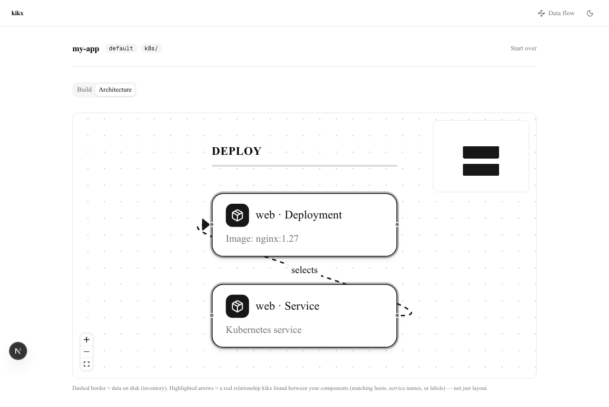
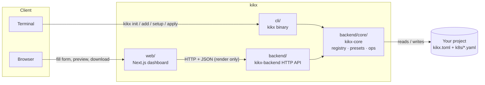

<div align="center">

# kikx

**Vendor real, editable infrastructure files straight into your project.**

Kubernetes manifests, Ansible playbooks and inventory, Terraform resources — rendered from a
template and written as *actual files* you own. No hidden dependency, no runtime package to
upgrade, no black box to debug later.

[](cli)
[](web)
[](backend/core/templates/ansible)
[](backend/core/templates/k8s)

</div>

---

Instead of installing a hidden dependency or generating output you have to trust blindly, `kikx`
renders a template with the values you gave it and writes the result into your project — flat,
plain files, sitting right next to your other code. Edit them, delete them, check them into git
like anything else. There's no registry lock-in and no generated-code comment telling you not to
touch the file.


## Table of contents

- [Concept](#concept)
- [Quick start](#quick-start)
- [Available components](#available-components)
- [Presets: setup vs. apply](#presets-setup-vs-apply)
- [Live architecture diagram](#live-architecture-diagram)
- [How it fits together](#how-it-fits-together)
- [Backend API](#backend-api)
- [Development](#development)
- [Current scope](#current-scope)

## Concept

A `kikx` project is a directory with a `kikx.toml` (project name, default namespace, output
folder) and a flat folder of vendored files:

```
my-app/
├── kikx.toml
└── k8s/
    ├── web-deployment.yaml
    ├── web-service.yaml
    └── web-ingress.yaml
```

`kikx add k8s/deployment --name web --image nginx:1.27` renders the `deployment` template with
the values you gave it (filling in sane defaults for anything you didn't) and writes
`k8s/web-deployment.yaml`. Run it again with `--force` to re-render and overwrite. That's the
whole model — no registry lock-in, no generated-code comments telling you not to touch the file.

The same registry covers more than Kubernetes: `ansible/inventory` renders a real, dynamic
`.ini` inventory (groups, `:children`, `:vars`) for servers you already have, `ansible/group-vars`
writes `group_vars/<group>.yml`, and `terraform/hetzner` / `terraform/digitalocean` render a
starting Terraform resource — all through the exact same `add`/render pipeline.

## Quick start

### CLI

```bash
cd your-project
kikx init --name my-app
kikx add k8s/deployment --name web --image nginx:1.27 --port 8080 --replicas 2
kikx add k8s/service --name web
kikx add k8s/ingress --name web --host web.example.com
kikx list
```

`init` and `add` both refuse to clobber an existing file unless you pass `--force`. Deployment's
pod label and Service's selector both default to `app: <name>`, so vendoring a deployment and a
service with the same `--name` gives you a pair that actually targets each other out of the box.

### Dashboard

Run the backend and the web app side by side:

```bash
cd backend && cargo run -p kikx-backend -- --port 4000 &
cd web && npm run dev
```

Open `http://localhost:3000`, fill in your project's name/namespace/output directory, then use
the Configure/Deploy tabs to build up components — preview the rendered output, add it to the
project (nothing touches disk until you download), and pull the result as a `.zip` or a
`kikx-preset.json` you can hand to `kikx setup`/`kikx apply`.

## Available components

Every component is `<category>/<name>` and resolves through the same registry, whether you're
using the CLI, the HTTP API, or the dashboard.

| Reference | What it renders |
|---|---|
| `k8s/deployment` | A Kubernetes Deployment |
| `k8s/service` | A Kubernetes Service |
| `k8s/ingress` | A Kubernetes Ingress |
| `terraform/digitalocean` | One or more DigitalOcean Droplets |
| `terraform/hetzner` | One or more Hetzner Cloud servers |
| `ansible/inventory` | A dynamic `.ini` inventory — multiple groups, hosts, `:children`, `:vars` |
| `ansible/group-vars` | `group_vars/<group>.yml` for one inventory group |
| `ansible/k8s-bootstrap` | A playbook that installs containerd/kubelet/kubeadm/kubectl on target hosts |
| `ansible/common-role` | A real, multi-file Ansible role (`tasks/`, `defaults/`, `handlers/`, `templates/`) |
| `ansible/playbook` | Assigns roles you've already added to an inventory group — the `site.yml` piece |

Point the dashboard's "Custom component" panel (or `kikx add <url-or-path>`) at any
`registry-item.json` — local file or URL — to render something that isn't built in. No kikx
update required.

## Presets: setup vs. apply

A preset is a portable JSON recipe — project details plus a list of components and their field
values — not pre-rendered output. Download one from the dashboard, then:

```bash
kikx setup ./my-app.kikx-preset.json      # bootstrap a brand-new project from it
kikx apply ./my-app.kikx-preset.json      # vendor it into a project you already have
```

`setup` seeds a fresh `kikx.toml`; `apply` never touches one, so it's safe to run inside an
existing repo (pass `--into <dir>` to nest the output under a subdirectory). Both re-render every
component fresh at apply-time — a preset is never a frozen snapshot.

## Live architecture diagram

The dashboard's Architecture view builds a real-time diagram from whatever you've added — not a
static picture. Edges are only drawn when kikx finds an actual relationship between your
components (a Service's label matching a Deployment's name, an Ingress's backend matching a
Service, a playbook's `hosts` matching an inventory group), so an edge on the diagram means
something, not just layout.



## How it fits together



Three pieces, one shared engine:

- **`cli/`** — the `kikx` binary. `init`, `add`, `list`, `setup`, `apply`. Talks straight to the
  filesystem, no server needed.
- **`backend/`** — a small, stateless HTTP API (`kikx-backend`) that wraps the same rendering
  logic so a UI can drive it. It only renders — the dashboard writes files client-side.
- **`backend/core/`** — `kikx-core`, the shared library: the component registry, preset
  resolution, project config, and the actual render/write operations. Both the CLI and the
  backend call into it — one implementation, two front ends.
- **`web/`** — a dashboard that renders components via `kikx-backend`, assembles them into a
  project entirely in the browser (persisted to `localStorage`, nothing written to disk until you
  download), and shows a live architecture diagram of what you've built.

`cli/` and `backend/` are independent Cargo packages, not a Cargo workspace — `cli`'s
`Cargo.toml` reaches `kikx-core` via a relative path dependency on `backend/core`, so each has
its own `Cargo.lock` and builds on its own.

## Backend API

All endpoints are under `/api`. The backend is stateless and only renders — it never writes to
disk; the dashboard downloads the result client-side.

| Method | Path | What it does |
|---|---|---|
| `GET` | `/api/health` | liveness check |
| `GET` | `/api/components` | list every built-in component reference |
| `GET` | `/api/registry/inspect?ref=<reference>` | field schema for one component (built-in, URL, or local file) |
| `POST` | `/api/render` | render a component's file(s) — returns content, writes nothing |

CORS is scoped to explicit localhost origins, configurable with `--allow-origin`.

## Development

```bash
# CLI
cd cli && cargo build && cargo test && cargo clippy -- -D warnings && cargo fmt --check

# Backend (+ its nested core library)
cd backend && cargo build && cargo test && cargo clippy --all-targets -- -D warnings && cargo fmt --check
cd backend/core && cargo test  # core's own unit tests aren't pulled in by backend's `cargo test`

# Web
cd web && npm install && npm run lint && npm run build
```

## Releasing

Pushing a tag matching `v*.*.*` runs [`.github/workflows/release.yml`](.github/workflows/release.yml):
it verifies the tag matches `cli/Cargo.toml`'s version, runs the Rust test suite, then builds and
publishes the `kikx` CLI as a GitHub Release with binaries for macOS (arm64 + x64), Linux (x64 +
arm64), and Windows (x64).

```bash
# bump the version in cli/Cargo.toml, backend/Cargo.toml, backend/core/Cargo.toml and web/package.json together
git commit -am "chore: release v0.2.0"
git tag v0.2.0
git push && git push --tags
```

## Current scope

Available today: the ten components listed above, dynamic multi-group Ansible inventories,
multi-file roles, a `site.yml`-style `ansible/playbook` component that assigns roles you've
already added to an inventory group, presets (`setup`/`apply`), a CLI, a stateless HTTP API, and
a dashboard with a real-time architecture diagram.

Not yet in scope: a single playbook targeting more than one group (today it's one `hosts` value
per playbook, so add one playbook component per group), scaffolding for arbitrary new role
*content* beyond hand-authoring a `registry-item.json` (kikx ships one example role — it doesn't
generate role internals for you), secrets/vault handling, and multi-environment inventories. This
is a local, single-user dev tool — no live cluster inspection, no auth.
