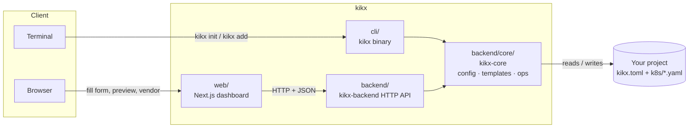
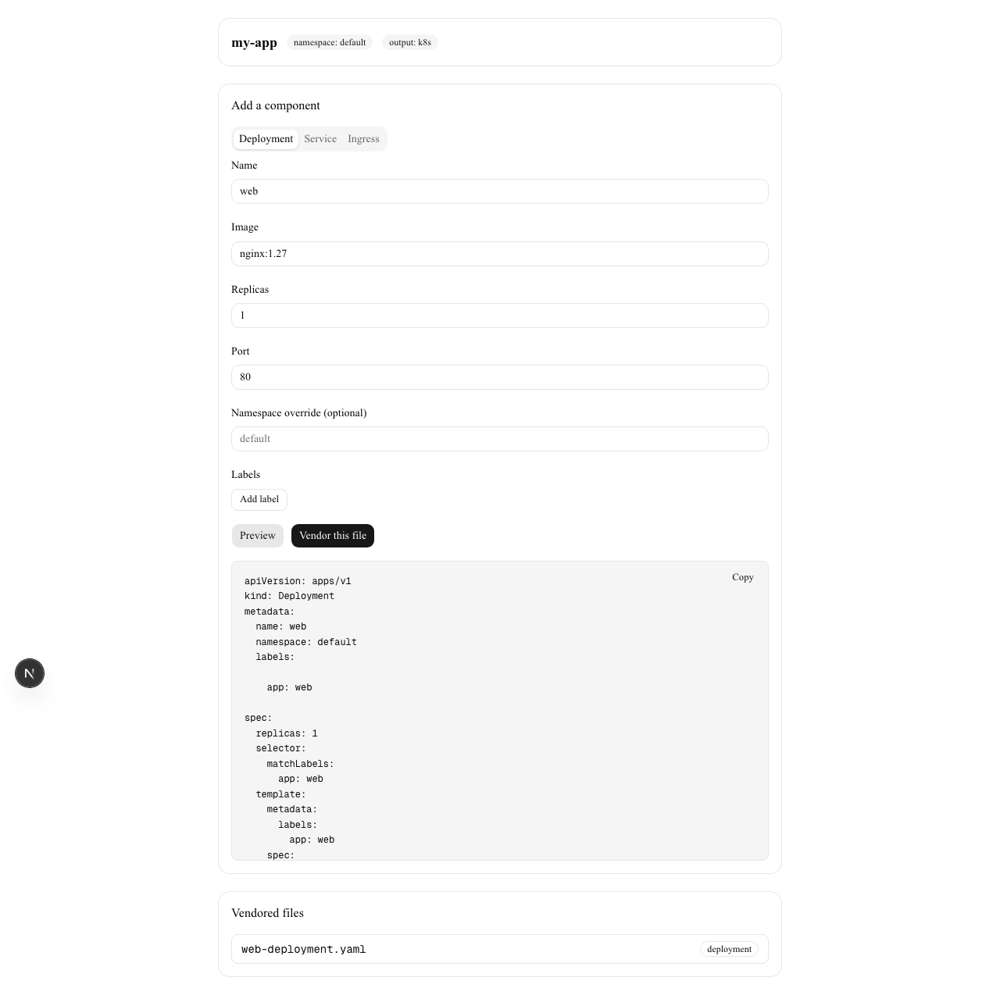

# kikx

Vendor real, editable Kubernetes manifests straight into your project.

Instead of installing a hidden dependency or generating output you have to trust blindly, `kikx` renders a Kubernetes manifest from a template and writes the *actual file* into your project — flat, plain YAML, sitting right next to your other code. You own it the moment it lands. Edit it, delete it, check it into git like any other file. There's no runtime package to upgrade and no black box to debug later.

## Concept

A `kikx` project is just a directory with a `kikx.toml` (project name, default namespace, output folder) and a flat folder of vendored manifests:

```
my-app/
├── kikx.toml
└── k8s/
    ├── web-deployment.yaml
    ├── web-service.yaml
    └── web-ingress.yaml
```

`kikx add k8s/deployment --name web --image nginx:1.27` renders the `deployment` template with the values you gave it (filling in sane defaults for anything you didn't) and writes `k8s/web-deployment.yaml`. Run it again with `--force` to re-render and overwrite. That's the whole model — no registry lock-in, no generated-code comments telling you not to touch the file.

## How it fits together



Three pieces, one shared engine:

- **`cli/`** — the `kikx` binary. `init`, `add`, `list`. Talks straight to the filesystem, no server needed.
- **`backend/`** — a small HTTP API (`kikx-backend`) that wraps the exact same logic behind REST endpoints, so a UI can drive it.
- **`backend/core/`** — `kikx-core`, the shared library: manifest templates, project config, and the actual `init`/`add`/`inspect` operations. Both the CLI and the backend call into it — one implementation, two front ends.
- **`web/`** — a dashboard that talks to `kikx-backend` over HTTP: pick a project directory, initialize it, fill in a component form, preview the rendered YAML, and vendor it for real.

## Two ways to use it

### CLI

```bash
cd your-project
kikx init --name my-app
kikx add k8s/deployment --name web --image nginx:1.27 --port 8080 --replicas 2
kikx add k8s/service --name web
kikx add k8s/ingress --name web --host web.example.com
kikx list
```

`init` and `add` both refuse to clobber an existing file unless you pass `--force`. Deployment's pod label and Service's selector both default to `app: <name>`, so vendoring a deployment and a service with the same `--name` gives you a pair that actually targets each other out of the box.

### Dashboard

Run the backend and the web app side by side, then drive the same operations from a browser:

```bash
cd backend && cargo run -p kikx-backend -- --port 4000 &
cd web && npm run dev
```

Open `http://localhost:3000`, enter the absolute path of the project you want to set up, initialize it if it's new, and use the component tabs to fill in a form, preview the rendered YAML, and vendor it — with a confirm dialog if the file already exists.



## Project structure

```
kikx/
├── cli/                  cargo package "kikx" — the CLI binary
│   └── src/commands/     init, add, list — thin wrappers over kikx-core
├── backend/               cargo package "kikx-backend" — the HTTP API
│   ├── core/               cargo package "kikx-core" — shared engine (path dependency of both cli/ and backend/)
│   └── src/http/           routes, request/response types, error mapping
└── web/                   Next.js + Tailwind dashboard
    ├── app/                 landing page + dashboard route
    ├── components/dashboard/ project header, component form, YAML preview, vendored files list
    └── lib/                  API client, zod schemas
```

`cli/` and `backend/` are independent Cargo packages (not a workspace) — `cli`'s `Cargo.toml` reaches `kikx-core` via a relative path dependency on `backend/core`, so each has its own `Cargo.lock` and builds on its own.

## Backend API

All endpoints are under `/api`, stateless — a project is identified by an absolute directory path you pass in, not a stored id.

| Method | Path | What it does |
|---|---|---|
| `GET` | `/api/health` | liveness check |
| `GET` | `/api/components` | list available component types |
| `GET` | `/api/project?dir=<abs path>` | current project state: config + vendored files |
| `POST` | `/api/project/init` | initialize `kikx.toml` at a directory |
| `POST` | `/api/project/components/preview` | render a component's YAML without writing it |
| `POST` | `/api/project/components` | render and write the file for real |

CORS is scoped to explicit localhost origins (configurable with `--allow-origin`) — this server writes files to disk, so it doesn't accept requests from arbitrary origins.

## Development

```bash
# CLI
cd cli && cargo build && cargo test && cargo clippy -- -D warnings && cargo fmt --check

# Backend (+ its nested core library)
cd backend && cargo build && cargo test && cargo clippy --all-targets -- -D warnings && cargo fmt --check
cd backend/core && cargo test  # core's own unit tests aren't pulled in by backend's `cargo test`

# Web
cd web && npm install && npm run lint && npm run build
```

## Current scope

Available today: `deployment`, `service`, `ingress` components, a CLI, an HTTP API, and a dashboard that drives real filesystem changes through it.

Not (yet) in scope: live Kubernetes cluster inspection, HA/topology validation against a real cluster, and auth — this is a local, single-user dev tool.
