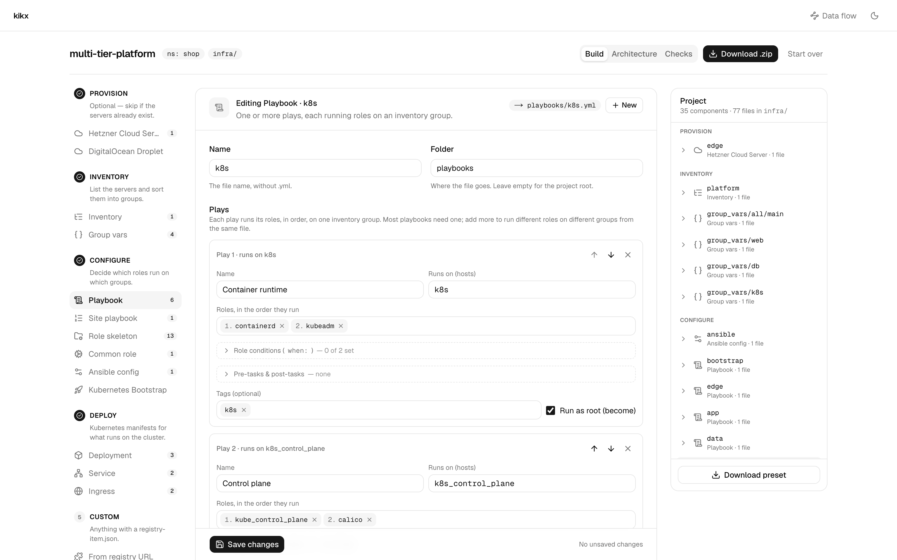

# Construire une plateforme Ansible dans le tableau de bord

Dans ce tutoriel, vous allez utiliser le tableau de bord de kikx pour construire un petit projet Ansible destiné à une plateforme composée de deux serveurs web et d'un serveur de base de données. Vous partirez d'un inventaire que vous avez déjà, puis vous ajouterez des group vars, un playbook avec deux plays et une condition de rôle, un playbook site et une configuration Ansible. En chemin, le tableau de bord repérera une erreur dans l'inventaire : vous la corrigerez, vous le laisserez générer les rôles manquants, vous regarderez l'architecture qu'il dessine et vous téléchargerez le résultat.

Comptez environ vingt minutes.

## Avant de commencer

Il vous faut :

- une copie locale du dépôt kikx ;
- une chaîne d'outils Rust (`cargo`) et Node.js avec `npm` ;
- deux fenêtres de terminal.

La dernière étape utilise aussi la CLI `kikx`. Si vous ne l'avez pas encore installée, [Votre premier projet avec la CLI](first-project-cli.md) explique comment faire.

## Démarrer le backend

Dans le premier terminal, depuis la racine de votre copie de kikx, copiez les réglages d'exemple et démarrez le backend :

```bash
cp backend/.env.example backend/.env
cd backend
cargo run
```

Lorsqu'il est prêt, vous devriez voir :

```text
kikx-backend listening on http://127.0.0.1:4000
```

Laissez-le tourner.

## Démarrer le tableau de bord

Dans le second terminal, depuis la racine de votre copie de kikx :

```bash
cp web/.env.example web/.env.local
cd web
npm install
npm run dev
```

Attendez qu'il affiche l'adresse locale et une ligne commençant par `✓ Ready` :

```text
- Local:         http://localhost:3000
```

Ouvrez `http://localhost:3000` dans votre navigateur. Vous devriez voir la page d'accueil de kikx avec un formulaire intitulé « Or build it here ». Au-dessus, « Start from a template » propose des projets prêts à l'emploi ; dans ce tutoriel, vous partirez plutôt d'un projet vide.

## Créer le projet

Remplissez le formulaire :

- « Project name » : `platform`
- « Default namespace » : laissez `default`
- « Output directory » : `infra`

Cliquez sur « Start building ».

Vous êtes maintenant dans l'éditeur de projet. Il comporte trois colonnes : les étapes à gauche (« Provision », « Inventory », « Configure », « Deploy », « Custom »), l'éditeur au centre, et le panneau « Project » à droite, qui indique « Nothing yet. Most projects start with an Inventory. » Voici la même disposition sur un projet beaucoup plus grand :



Au-dessus des colonnes, vous devriez voir le nom du projet, les badges `ns: default` et `infra/`, et trois onglets : « Build », « Architecture » et « Checks ».

## Importer un inventaire

L'éditeur affiche déjà « New inventory », et son champ « Name » indique `platform`. Au lieu de saisir les hôtes un par un, vous allez coller un inventaire existant.

À côté de « Hosts (1) », cliquez sur « Import inventory.ini ». Une boîte de dialogue intitulée « Import an existing inventory » s'ouvre. Collez ceci dans la zone de texte :

```ini
[web]
web-01 ansible_host=192.0.2.10
web-02 ansible_host=192.0.2.11 ansible_user=root

[db]
db-01 ansible_host=198.51.100.20

[platform:children]
web
db

[platform:vars]
ansible_user=deploy
```

Sous la zone de texte, vous devriez voir le décompte « 3 hosts · 3 groups ». Cliquez sur « Replace hosts & groups ».

La boîte de dialogue se ferme et le formulaire se remplit : « Hosts (3) » avec `web-01`, `web-02` et `db-01`, et une section « Groups » avec `web`, `db` et `platform`. La ligne `platform` liste `web` et `db` comme groupes enfants et `ansible_user=deploy` comme variables.

Faites défiler jusqu'à « Preview ». L'aperçu en direct montre `platform-inventory.ini`, tel que vous l'obtiendrez après le rendu :

```ini
[web]
web-01 ansible_host=192.0.2.10
web-02 ansible_host=192.0.2.11 ansible_user=root

[db]
db-01 ansible_host=198.51.100.20

[platform:children]
web
db

[platform:vars]
ansible_user=deploy
```

Cliquez sur « Add to project ». Une notification indique « Added platform », et le panneau « Project » liste maintenant `platform` sous « Inventory ».

Remarquez deux autres choses : le panneau « Project » affiche « 1 warning » avec un bouton « Review », et l'onglet « Checks » porte le compteur `1`. Laissez cela de côté pour l'instant ; vous y reviendrez.

## Ajouter des group vars

Les serveurs de base de données ont besoin de quelques réglages imbriqués. Dans la colonne de gauche, sous « Inventory », cliquez sur « Group vars ». L'éditeur passe à « New group vars ».

1. Dans « Group », saisissez `db`.
2. Cochez « Folder layout » pour que le fichier devienne `group_vars/db/main.yml`.
3. À côté de « Variables », passez de « Key / value » à « YAML ».
4. Collez ceci dans la zone de texte :

   ```yaml
   postgres:
     version: 16
     max_connections: 200
     databases:
       - app
       - reports
   ```

Vous devriez voir l'aperçu montrer `group_vars/db/main.yml` :

```yaml
---
postgres:
  version: 16
  max_connections: 200
  databases:
    - app
    - reports
```

Cliquez sur « Add to project ». Le panneau « Project » contient maintenant `group_vars/db/main` sous « Inventory ».

## Ajouter un playbook avec deux plays

Dans la colonne de gauche, sous « Configure », cliquez sur « Playbook ».

1. Dans « Name », saisissez `services`.
2. Dans « Folder », saisissez `playbooks`. Le champ affiche `playbooks` en gris avant que vous ne tapiez ; ce n'est qu'une indication, alors saisissez-le.

Remplissez « Play 1 » :

1. « Name » : `Web tier`
2. « Runs on (hosts) » : `web`
3. « Roles, in the order they run » : saisissez `nginx` et appuyez sur Entrée. Il devient une puce numérotée.

Cliquez sur « Add play » et remplissez « Play 2 » :

1. « Name » : `Database tier`
2. « Runs on (hosts) » : `db`
3. « Roles, in the order they run » : saisissez `postgres` et appuyez sur Entrée, puis `backups` et appuyez sur Entrée.

Les sauvegardes doivent pouvoir être désactivées. Sous « Play 2 », ouvrez « Role conditions (when:) ». La section liste un champ par rôle. Dans le champ à côté de `backups`, saisissez :

```text
backups_enabled | default(true)
```

Vous devriez voir l'aperçu montrer `playbooks/services.yml` :

```yaml
---
- name: Web tier
  hosts: web
  become: true
  roles:
    - nginx

- name: Database tier
  hosts: db
  become: true
  roles:
    - postgres
    - role: backups
      when: backups_enabled | default(true)
```

Cliquez sur « Add to project ». `services` apparaît dans le panneau « Project » sous « Configure ».

## Ajouter le playbook site

Sous « Configure », cliquez sur « Site playbook ».

1. Dans « Name », saisissez `site`.
2. Sous « Imports, in run order », à côté de « from this project: », cliquez sur la puce `playbooks/services.yml`. Une ligne apparaît avec ce chemin.
3. Le nom de la ligne est rempli avec le nom du premier play, `Web tier`. Cet import exécute le playbook entier : remplacez-le donc par `Services`.

Vous devriez voir l'aperçu montrer `site.yml` :

```yaml
---
- name: Services
  import_playbook: playbooks/services.yml
```

Cliquez sur « Add to project ». Le panneau « Project » indique maintenant « 4 components · 4 files in infra/ ».

## Ajouter une configuration Ansible

Le playbook se trouve dans `playbooks/`, et ses rôles se trouveront dans `roles/`, à la racine de `infra/`. Ansible cherche les rôles à côté du playbook : il lui faut donc un `ansible.cfg` qui pointe vers eux.

Sous « Configure », cliquez sur « Ansible config ». L'éditeur passe à « New ansible config », et « Name » contient déjà `ansible`.

1. Dans « Inventory file », saisissez `platform-inventory.ini`. Le champ l'affiche en gris avant que vous ne tapiez ; ce n'est qu'une indication, alors saisissez-le.
2. Laissez « Roles path » à `roles`.

Vous devriez voir l'aperçu montrer `ansible.cfg` :

```ini
[defaults]
inventory = platform-inventory.ini
roles_path = roles
```

Cliquez sur « Add to project ». Le panneau « Project » indique maintenant « 5 components · 5 files in infra/ ».

## Corriger l'avertissement

Cliquez sur l'onglet « Checks ». La page liste ce que kikx a trouvé en croisant vos composants :

- sous « Warnings » : « web-02 sets ansible_user=root, overriding [platform:vars] ansible_user=deploy », avec l'explication *Host vars win over group vars. Clear ansible_user on the host if the group value is the one you want.* ;
- sous « Notes » : « services uses 3 roles kikx doesn't vendor », qui liste `nginx, postgres, backups`.

L'avertissement a raison : l'inventaire collé contenait encore un ancien `ansible_user=root` sur `web-02`, qui ignorerait donc l'utilisateur `deploy` qu'utilisent tous les autres hôtes. Corrigez-le :

1. À côté de l'avertissement, cliquez sur « Open platform ». Vous revenez dans l'onglet « Build », sur « Editing Inventory · platform ».
2. Sur la ligne `web-02`, ouvrez « Connection & host vars ». Son résumé indique « user root ».
3. Videz le champ « ssh user (inherit) ».

Dans l'aperçu, vous devriez voir la ligne `web-02` perdre son utilisateur :

```ini
web-02 ansible_host=192.0.2.11
```

Cliquez sur « Save changes ». Une notification indique « Saved platform ». Le compteur d'avertissements disparaît du panneau « Project » et de l'onglet « Checks ».

## Générer les rôles

Cliquez de nouveau sur l'onglet « Checks ». Il ne reste que la note : « services uses 3 roles kikx doesn't vendor ».

Cliquez sur « Scaffold 3 roles ». Une notification indique « Scaffolded 3 roles », et vous devriez voir la page afficher :

```text
No conflicts found — hosts, groups, playbooks and manifests all line up.
```

Cliquez sur l'onglet « Build ». Le panneau « Project » liste `nginx`, `postgres` et `backups` sous « Configure », chacun comme « Role skeleton · 4 files ». Cliquez sur la flèche à côté de `postgres` pour voir ses quatre fichiers, puis cliquez sur `roles/postgres/tasks/main.yml` pour le lire :

```yaml
---
- name: Placeholder — replace with the real tasks for postgres
  ansible.builtin.debug:
    msg: "postgres ran on {{ inventory_hostname }}"
```

## Examiner l'architecture

Cliquez sur l'onglet « Architecture ». kikx dessine votre projet en couloirs, de gauche à droite dans l'ordre où les choses se produisent : « Inventory », « Playbooks », « Roles ».

Vous devriez voir :

- `ansible.cfg` (« roles_path: roles ») dans le couloir « Inventory », sans arête ;
- `platform` (« 2 child groups ») avec une arête « includes » vers `web` (« 2 hosts ») et une vers `db` (« 1 host ») ;
- `group_vars/db/main` avec une arête « configures » vers `db` ;
- `playbooks/services.yml` (« 2 plays · 3 roles ») avec des arêtes « targets » vers `web` et `db` ;
- `site.yml` avec une arête « imports » vers `playbooks/services.yml` ;
- trois arêtes « runs » du playbook vers `roles/nginx`, `roles/postgres` et `roles/backups`.

Survolez un nœud pour mettre en évidence ses connexions ; cliquez sur un nœud pour l'ouvrir dans l'éditeur. Sur un projet plus grand, la même vue ressemble à ceci :


## Télécharger le projet

Cliquez sur « Download .zip » en haut à droite. Votre navigateur enregistre `platform.zip`. Décompressez-le dans un répertoire vide et regardez son contenu :

```bash
unzip platform.zip -d platform
cd platform
find . -type f | sort
```

Vous devriez voir :

```text
./infra/ansible.cfg
./infra/group_vars/db/main.yml
./infra/platform-inventory.ini
./infra/playbooks/services.yml
./infra/roles/backups/defaults/main.yml
./infra/roles/backups/handlers/main.yml
./infra/roles/backups/meta/main.yml
./infra/roles/backups/tasks/main.yml
./infra/roles/nginx/defaults/main.yml
./infra/roles/nginx/handlers/main.yml
./infra/roles/nginx/meta/main.yml
./infra/roles/nginx/tasks/main.yml
./infra/roles/postgres/defaults/main.yml
./infra/roles/postgres/handlers/main.yml
./infra/roles/postgres/meta/main.yml
./infra/roles/postgres/tasks/main.yml
./infra/site.yml
./kikx.toml
```

Rien n'avait été écrit sur votre disque jusqu'ici : le projet vivait dans l'onglet du navigateur.

Vérifiez qu'Ansible lit ce que vous avez construit. Depuis `infra/`, interrogez-le sur `db-01` :

```bash
cd infra
uvx --from ansible-core ansible-inventory -i platform-inventory.ini --host db-01
```

```json
{
    "ansible_host": "198.51.100.20",
    "ansible_user": "deploy",
    "postgres": {
        "databases": [
            "app",
            "reports"
        ],
        "max_connections": 200,
        "version": 16
    }
}
```

L'utilisateur vient de `[platform:vars]` et les réglages des group vars que vous avez collées. Vérifiez ensuite les playbooks. `ansible.cfg` fournit à Ansible l'inventaire et le chemin des rôles : aucune autre option n'est nécessaire :

```bash
uvx --from ansible-core ansible-playbook site.yml --syntax-check
```

```text

playbook: site.yml
```

## Télécharger le preset

Revenez au tableau de bord, dans l'onglet « Build ». En bas du panneau « Project », cliquez sur « Download preset ». Votre navigateur enregistre `platform.kikx-preset.json`, et vous devriez voir le bouton remplacé par deux commandes :

```text
kikx setup ./platform.kikx-preset.json
kikx apply ./platform.kikx-preset.json
```

Le preset est la recette de votre projet, pas les fichiers eux-mêmes. Reconstruisez le projet à partir de lui avec la CLI, dans un nouveau répertoire vide qui ne contient que le preset :

```bash
mkdir rebuilt
cd rebuilt
cp ~/Downloads/platform.kikx-preset.json .
kikx setup ./platform.kikx-preset.json
```

kikx liste les 17 fichiers qu'il a écrits. Vous devriez voir en première ligne :

```text
Initialized kikx project `platform` — wrote 17 file(s) to …/rebuilt/infra
```

Ce sont les mêmes fichiers que dans le zip.

## Arrêter les serveurs

Appuyez sur Ctrl+C dans les deux terminaux.

## Ce que vous avez fait

Vous avez importé un inventaire existant, ajouté des group vars en YAML dans une disposition en dossier, écrit un playbook à deux plays avec une condition de rôle, l'avez relié à `site.yml` et avez indiqué à Ansible où trouver vos rôles avec `ansible.cfg`. La vue « Checks » a repéré une variable d'hôte qui écrasait silencieusement une variable de groupe ; vous l'avez corrigée et avez généré les trois rôles dont le playbook avait besoin. Vous avez vu l'architecture que kikx a dessinée à partir de vos composants, téléchargé le projet sous forme de zip accepté par Ansible, et l'avez reconstruit à partir d'un preset avec la CLI.

Pour aller plus loin :

- apporter votre propre inventaire : [Importer un inventaire Ansible existant](../how-to/import-an-inventory.md) ;
- davantage de plays, de pre-tasks et de post-tasks : [Écrire un playbook à plusieurs plays avec des conditions de rôle](../how-to/multi-play-playbooks.md) ;
- toutes les vérifications et ce qui les déclenche : [Vérifications](../reference/checks.md) ;
- continuer à affiner le diagramme à la main : [Exporter l'architecture vers draw.io](../how-to/export-to-drawio.md) ;
- `setup` ou `apply` : [Partager un projet sous forme de preset](../how-to/presets.md) ;
- partir d'un projet prêt à l'emploi plutôt que d'une page vide : [Démarrer depuis un template](../how-to/presets.md#démarrer-depuis-un-template) ;
- comment les arêtes sont choisies : [Comment le diagramme d'architecture est dessiné](../explanation/architecture-diagram.md).
