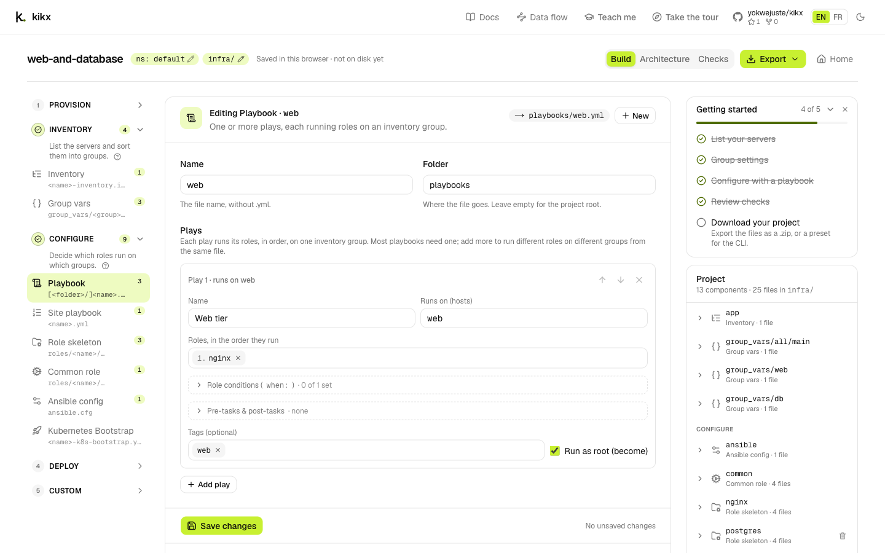
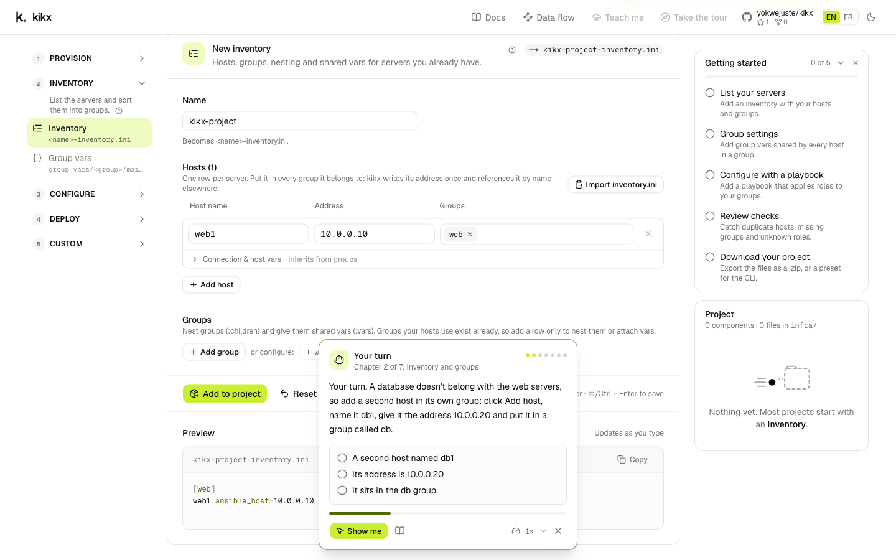

# The web app

Every screen and control of the kikx web app, with the labels as they appear in the English
interface. The app renders through the same engine as the CLI, so the files it produces are the
ones described in [Components](components.md). To learn the app step by step, follow
[Build an Ansible platform in the dashboard](../tutorials/platform-in-the-dashboard.md) or
[Let kikx show you](../tutorials/teach-me.md).

| Route | Screen |
|-|-|
| `/` | [Home](#home) |
| `/build` | [The builder](#the-builder) |
| `/flow` | [Data flow](#data-flow) |
| `/learn/app` | [Learn pages](#learn-pages): app lessons |
| `/learn/cli` | [Learn pages](#learn-pages): the practice terminal |

## Header

The header sits at the top of every page. On narrow screens some buttons show only their icon.

| Control | What it does |
|-|-|
| **kikx** logo | Goes back to the home page. |
| **Docs** | Opens this documentation, in the language the app is using. |
| **Data flow** | Opens the [Data flow](#data-flow) page. |
| **Teach me** | Opens the lesson picker. See [Teach me](#teach-me). Shown on wide screens only, and disabled while a lesson plays. |
| **Take the tour** | Replays the guided tour of the current page. Shown on the home page and in the builder only, and disabled while a lesson plays. See [Tour](#tour). |
| GitHub | Opens the kikx repository on GitHub. The link shows the repository name with its star and fork counts. |
| **EN** / **FR** | Switches the interface language. See [Languages and themes](#languages-and-themes). |
| Theme button (sun or moon icon) | Switches between the light and the dark theme. |

## Home

The home page (`/`) is where you start or resume a project.

### In the app / With the CLI

A toggle under the introduction picks how you want to use kikx. The choice is remembered in this
browser and also sets which lessons the [Teach me](#teach-me) picker shows first.

- **In the app** shows the templates, **Blank project** and **Open a preset**.
- **With the CLI** shows the commands that do the same thing in a terminal, from installing kikx to
  `kikx apply`, with a **Copy commands** button that copies them all. See
  [Your first project with the CLI](../tutorials/first-project-cli.md).

### Start from a template

**Start from a template** lists the built-in templates. Each card shows the template's title and
description, badges for the stages it covers (**Provision**, **Inventory**, **Configure**,
**Deploy**), its name and its number of components. Click a card to load the template and open it
in the builder.

Opening a template replaces the project you have in this browser. Export it first if you want to
keep it. See [Start from a template in the app](../how-to/start-from-template-web.md).

### Blank project

Type a **Project name** and click **Start building**. The default namespace and output directory are
filled in from the registry defaults; change them later with the [settings badges](#project-settings-badges).
Starting a blank project replaces the project you have in this browser.

### Open a preset

**Open a preset** opens a `.kikx-preset.json` you exported earlier, from this browser or another
one, and takes you to the builder. A file that isn't a kikx preset shows **Couldn't open that
preset**. Like a template, it replaces the current project. See
[Export and reopen a project in the app](../how-to/export-and-reopen-web.md#reopen-a-preset-in-the-app).

### Resume card

When this browser already holds a project, a card at the top says **Continue** followed by the
project name, with the number of components it has.

- **Continue** opens the builder where you left off.
- The close button (**Discard** followed by the project name) asks for confirmation. **Discard**
  removes the project and its unsaved drafts from this browser; **Keep** cancels.

At the bottom of the page, **See how data flows through kikx** opens the [Data flow](#data-flow)
page.

## The builder

The builder (`/build`) is where you add and edit components. If no project exists yet, it says
**No project details yet.** with a link back to the home page.

### Top bar

| Control | What it does |
|-|-|
| Project name | The name you gave the project. It names the downloaded files. |
| `ns: <namespace>` badge | Opens **Project settings** with **Default Kubernetes namespace** focused. |
| `<directory>/` badge | Opens **Project settings** with **Output directory** focused. |
| Storage status | **Saved in this browser · not on disk yet** until you export; then **Downloaded** with how long ago, or **Changes since last download** once you edit after an export. Hover it for details. |
| **Project (n)** | On very wide screens only: opens the [project drawer](#project-drawer). |
| **Build** / **Architecture** / **Checks** | Switch between the [three views](#views). |
| **Export** | Opens the [Export menu](#export-menu). Disabled until the project has a component. |
| **Home** | Back to the home page. The project stays saved in this browser. |

#### Project settings badges

Both badges open the same **Project settings** dialog:

- **Default Kubernetes namespace**: the namespace given to Kubernetes components that don't set
  their own. Components already in the project keep the old one; new components, and ones you open
  and save again, use the new one.
- **Output directory**: the folder your files are written to inside the `.zip`.

Click **Save** to apply or **Cancel** to close. See [Change project settings in the app](../how-to/project-settings-web.md).

### Component catalog

The left column lists the components by stage, in the order you usually need them. Each stage
header shows its number, or a tick once the project has a component from it, and a count of those
components. Click a header to open or close the stage. On screens narrower than a laptop the
catalog is behind a **Components** button above the editor.

| Stage | Entries |
|-|-|
| **Provision** | **Cloud server** |
| **Inventory** | **Inventory**, **Group vars** |
| **Configure** | **Playbook**, **Site playbook**, **Role skeleton**; under **Show more (3)**: **Common role**, **Ansible config**, **Kubernetes Bootstrap** |
| **Deploy** | **Deployment**, **Service**, **Ingress** |
| **Custom** | **From registry URL** |

Each entry shows the file it writes and how many of it the project has. **Show more** reveals the
less common entries of a stage and **Show fewer** hides them again; once you use one of them it
stays visible. The **?** next to a stage hint explains the term, with a link to the docs.

On an empty project the editor area shows **Your project is empty** instead: one card per stage
with a button such as **Add Inventory**, and a link **Or start from a template**.

Where each component lives in the catalog, with its form fields, is listed in
[Components](components.md). To provision servers or deploy to Kubernetes from the catalog, see
[Provision cloud servers in the app](../how-to/provision-servers-web.md) and
[Deploy an app to Kubernetes in the app](../how-to/deploy-kubernetes-web.md).

### Editor and live preview

Clicking a catalog entry opens its form. The title reads **New** followed by the entry name, or
**Editing** followed by the entry name and the component's name when you open an existing one. A
badge shows the file the component writes, or the number of files. When editing, **New** starts a
fresh form of the same kind.

- Fields start with sensible defaults. Required fields that are empty or invalid are highlighted,
  with the reason under the field.
- **Preview** shows the rendered files and **Updates as you type**. Each file has a **Copy**
  button. While required fields are missing it says **The preview appears as soon as the required
  fields are filled in.**; if a later change makes the form invalid, it keeps the last valid render.
- A file another component already writes is flagged in the preview and in the save bar.
- When you open a component that checks flag, its issues are listed above the form.
- Unsaved edits are kept as a draft in this browser. When you come back to the form it says
  **Restored your unsaved draft from** followed by the date, with **Discard draft**.

To open, change, remove and restore components step by step, see
[Edit components in the app](../how-to/edit-components-web.md).

### Save bar

The save bar sticks to the bottom of the form.

| Control | What it does |
|-|-|
| **Add to project** | Renders the component and adds it. Shown for a new component. |
| **Save changes** | Renders and saves the component you are editing. |
| **Reset** / **Discard changes** | Throws away your unsaved edits. Shown once you change something. |
| Hint | **⌘/Ctrl + Enter to save**, **Draft kept in this browser** or **No unsaved changes**. |

Press {kbd}`Ctrl+Enter` ({kbd}`Cmd+Enter` on macOS) anywhere in the form to add or save.

After adding, a notification says **Added** with the component name and offers **Next:** with the
entry that usually comes next. If saving would replace files another component writes, the bar
says so first and a dialog asks you to **Keep existing** or **Replace**. See
[Resolve file conflicts and checks](../how-to/resolve-conflicts.md).

### Project panel

The **Project** panel lists everything you've added, grouped by stage, with a summary such as
**5 components · 5 files in infra/**. When checks find errors or warnings it shows their count and
a **Review** button that opens the **Checks** view.

On each row:

- click the name to open the component in the editor;
- click the arrow (**Show files**) to list the files it writes, then click a file to read it in a
  file viewer. The viewer says which component rendered it; edit the component to change it;
- the bin icon (**Remove**) removes the component. The notification offers **Undo**.

An empty project says **Nothing yet. Most projects start with an Inventory.**

### Getting started

The **Getting started** checklist sits above the **Project** panel and ticks itself as you go:

1. **List your servers**: add an inventory.
2. **Group settings**: add group vars.
3. **Configure with a playbook**: add a playbook.
4. **Review checks**: open **Checks**, or have components with no errors.
5. **Download your project**: export the project.

It shows your progress, such as **2 of 5**. Click an open step to jump to the right form or view.
Click the title to fold it, or the close button (**Hide the checklist**) to hide it for this
project. It disappears once every step is done.

### Project drawer

On very wide screens the **Project** panel and the checklist move into a drawer to leave room for
the editor and its preview side by side. Open it with **Project (n)** in the top bar, where `n` is
the number of components. Choosing a component or a step closes the drawer.

### Views

| Tab | What it shows |
|-|-|
| **Build** | The catalog, the editor and the project panel. |
| **Architecture** | A diagram of how your components connect, in swimlanes from left to right. Hover a node to trace its connections, click it to edit the component. **Expand** makes the diagram larger and **Collapse** shrinks it back. **Export to draw.io** downloads the diagram. See [How the architecture diagram is drawn](../explanation/architecture-diagram.md) and [Export the architecture to draw.io](../how-to/export-to-drawio.md). |
| **Checks** | What kikx found when it cross-checked your components, under **Errors**, **Warnings** and **Notes**. Each issue has an **Open** button, followed by the component name, for each component concerned; roles that kikx doesn't vendor can be created with **Scaffold** followed by the count. With nothing to report it says **No conflicts found. Hosts, groups, playbooks and manifests all line up.** See [Checks](checks.md). |

The **Checks** tab shows the number of errors and warnings next to its label.

### Export menu

| Item | What it does |
|-|-|
| **Files (.zip)** | Downloads the rendered files, inside the output directory, plus `kikx.toml`, as `<project>.zip`. |
| **Preset (.kikx-preset.json)** | Downloads the project's recipe, to reopen here or run with `kikx apply`. See [Preset format](preset-format.md). |
| **CLI command** | Opens **Run it with the CLI**: the `kikx setup` and `kikx apply` commands for this project's preset, each with a copy button, and **Download preset**. |

Exporting is the only moment kikx writes anything to your machine. See
[Export and reopen a project in the app](../how-to/export-and-reopen-web.md) and
[Where your project lives](../explanation/project-storage.md).

### On a phone

On a phone-sized screen the builder first asks **Do you really want to do this on your phone?**
**Continue on my phone** carries on; **Copy the link for my computer** copies the page address.

## Data flow

The **Data flow** page (`/flow`) draws how kikx turns a template into files. Pick **CLI** or
**Dashboard** at the top right: the path that driver takes lights up, from the terminal or the
browser through the CLI or the backend to the shared engine, and on to `kikx.toml` and the rendered
files. Solid borders are actors and processes; dashed borders are data on disk. You can drag the
nodes, zoom with the controls and move around with the minimap. See
[How the pieces fit together](../explanation/project-layout.md).

## Teach me

**Teach me** runs guided lessons inside the app. kikx moves a pointer, types into the forms and
clicks the buttons while a caption explains each step. The lessons themselves are described in
[Let kikx show you](../tutorials/teach-me.md).

### Lesson picker

The picker lists the lessons under **Basics** and **Going further**. A toggle at the top switches
between **In the app** and **With the CLI** lessons. Each card shows the title, a short
description, how long it takes, what **You'll learn**, and **Done** once you've finished it. Click
a card to start.

### Lesson card

While a lesson runs, a card next to the highlighted element shows the lesson title, the chapter
(for example **Chapter 2 of 7**) and the caption. Your own clicks are paused while kikx is acting.

| Control | What it does |
|-|-|
| **Pause** | Stops the lesson and gives you control of the page. |
| **Resume** | Carries on from the same step. |
| **Skip ahead** | Moves to the next step without waiting for the caption. |
| **Learn more** (book icon) | Opens the docs page about the current step in a new tab, and pauses the lesson. Shown only on steps that have one. |
| **Speed** | Plays the lesson at **0.5×**, **1×**, **1.5×** or **2×**. The choice is remembered. |
| **Stop the lesson** | Ends the lesson and puts your project back. {kbd}`Esc` does the same while the lesson is playing. |

If the page changed while the lesson was paused and kikx can't find the next thing to click, the
card says so. Put the page back and press **Resume**, or stop the lesson.

### Your turn

Some steps hand over to you. The card is titled **Your turn** and lists what to do, ticking each
item as you do it. **Show me** does it for you. When all items are ticked the lesson carries on.

### Recap

At the end the card shows **Lesson complete** and **What you learned**, with:

- **Back to my project**: ends the lesson and restores the project you had;
- **Keep this project**: keeps the project the lesson built. Shown only when you had no project
  before the lesson;
- **Next:** followed by the next lesson's title, when there is one.

A lesson works on an empty project and sets yours aside. See
[Where your project lives](../explanation/project-storage.md#the-teach-me-sandbox).

## Tour

**Take the tour** highlights the main parts of the page, one at a time, with a short explanation.
The home tour covers the welcome text, the templates, the blank project, **Open a preset**, the
**In the app** / **With the CLI** toggle, **Data flow** and the tour button itself. The builder tour
covers the catalog, the editor, the checklist, the project panel, the views and **Export**.

Each tour opens by itself the first time you visit the page. Use **Next** and **Back** to move,
**Done** on the last step, or the close button to leave.

## Learn pages

- `/learn/app` shows **Learn kikx in the app** with **Choose a lesson**, which opens the picker on
  the app lessons.
- `/learn/cli` is the **Practice terminal**: a terminal on one side and the **Files** it writes on
  the other, with **Choose a lesson** for the CLI lessons. Commands run on the real kikx engine but
  the files stay in this browser tab. Drag the divider, or focus it and use the arrow keys, to
  resize the two panes.

How the practice terminal behaves, and its buttons for running the line, clearing the screen,
copying the session as a script and sharing a replay link, is described in
[Practice the CLI in your browser](../how-to/practice-cli-in-browser.md).

## Keyboard shortcuts

| Where | Keys | Action |
|-|-|-|
| Builder form | {kbd}`Ctrl+Enter` or {kbd}`Cmd+Enter` | Add the component, or save your changes |
| Teach me lesson | {kbd}`Esc` | Stop the lesson while it plays |
| Practice terminal | {kbd}`Enter` | Run the line |
| Practice terminal | {kbd}`Up` / {kbd}`Down` | Recall earlier commands |
| Practice terminal | {kbd}`Tab` | Complete a command, flag, name or file; press twice to list the choices |
| Practice terminal | {kbd}`Ctrl+A` / {kbd}`Ctrl+E` | Move to the start / end of the line |
| Practice terminal | {kbd}`Ctrl+U` | Clear the line |
| Practice terminal | {kbd}`Ctrl+W` | Delete the previous word |
| Practice terminal | {kbd}`Ctrl+K` | Delete to the end of the line |
| Practice terminal | {kbd}`Ctrl+C` | Cancel the line |
| Practice terminal | {kbd}`Ctrl+L` | Clear the screen |
| Practice terminal divider | Arrow keys | Resize the terminal and the files |

## Languages and themes

| Setting | Values | Default | Remembered in |
|-|-|-|-|
| Language | English (**EN**), Français (**FR**) | Your browser's preferred language when it is one of these, otherwise English | A cookie, for a year |
| Theme | Light, dark | Your system setting | This browser |

The language applies to the whole interface, the lessons and the **Docs** link. Your project
content, such as names and file contents, is never translated.

## See also

- [Build an Ansible platform in the dashboard](../tutorials/platform-in-the-dashboard.md)
- [Let kikx show you](../tutorials/teach-me.md)
- [Edit components in the app](../how-to/edit-components-web.md)
- [Export and reopen a project in the app](../how-to/export-and-reopen-web.md)
- [Practice the CLI in your browser](../how-to/practice-cli-in-browser.md)
- [Where your project lives](../explanation/project-storage.md)
- [Components](components.md)
- [Checks](checks.md)
