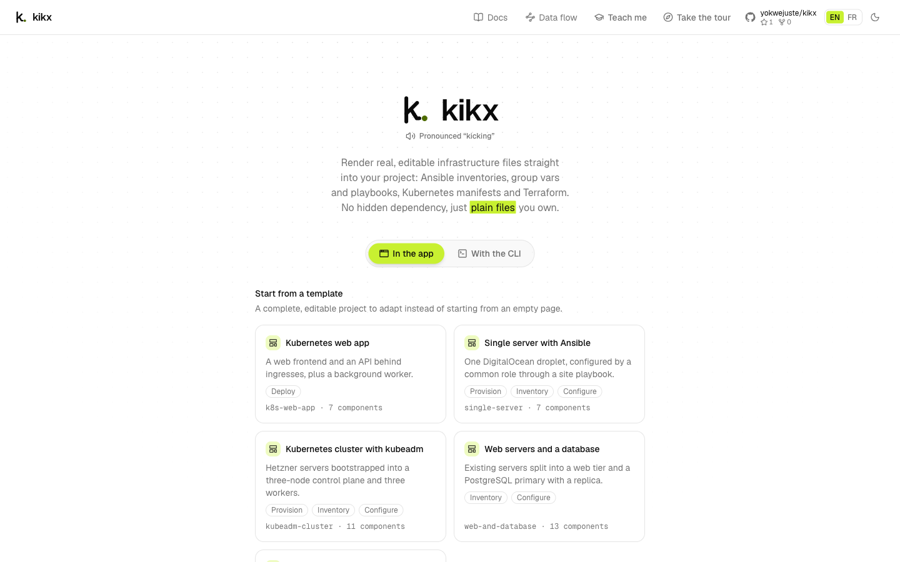
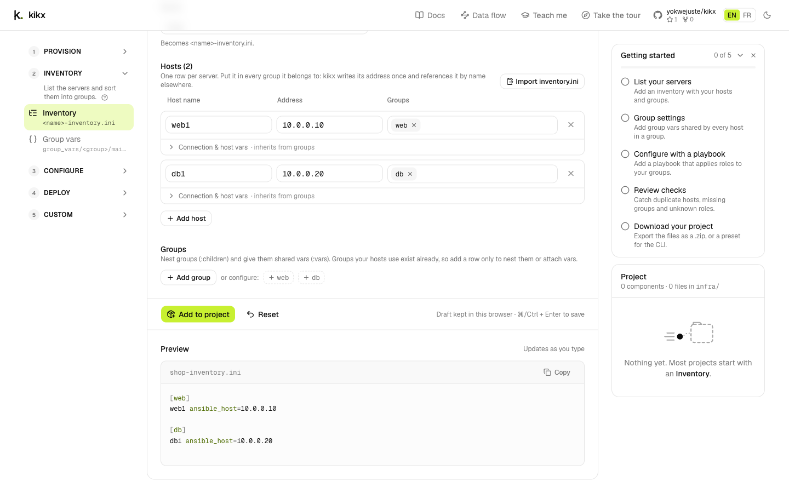
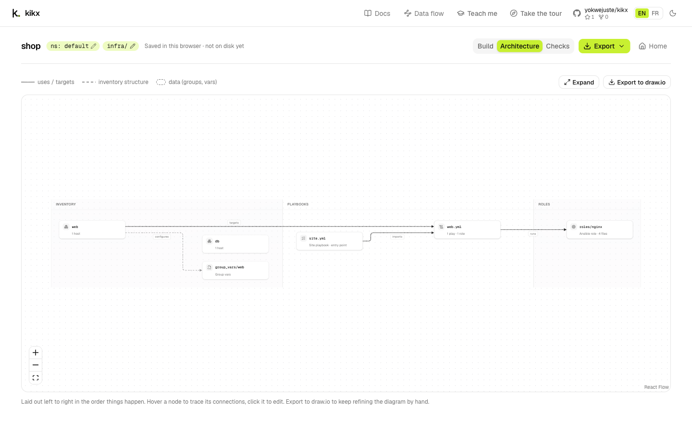

# Your first project in the web app

In this tutorial you'll build a small Ansible project in the kikx web app, without installing
anything. By the end you'll have:

- an inventory with a web server and a database server, each in its own group;
- group vars for the `web` group;
- a playbook with one play that runs the `nginx` role on the web servers;
- the `nginx` role itself, scaffolded for you when Checks notices it is missing;
- a `site.yml` entry point;

and you'll have downloaded the project as plain files.

It takes about ten minutes. It is the browser twin of
[Your first project with the CLI](first-project-cli.md).

:::{tip}
Prefer to watch first? The **Build your first project** lesson covers the same ground in about two
minutes: kikx drives the page while a caption explains each step, and hands you the controls a few
times. [Start this lesson](teach:firstProject)
:::

## Before you start

You need a web browser on a computer. The builder uses a three-column layout, so a laptop or
desktop screen works best.

Nothing is written to your disk while you work. The project lives in your browser until you export
it.

## Open the app

Open the kikx web app in your browser. The first time you visit, a short tour starts on its own.
Click **Next** to follow it, or close it; you can replay it any time with **Take the tour** in the
top bar.



The home page has a toggle with two choices:

- **In the app**, selected, shows how to start a project here in the browser.
- **With the CLI** shows the commands you'd run in a terminal instead, with a **Copy commands**
  button. Use it when you'd rather work with the [CLI](first-project-cli.md).

Under **In the app** you'll find three ways to start:

- **Start from a template** lists ready-made projects, from a single server to a multi-tier
  platform. Click one to open it in the builder and adapt it.
- **Blank project** starts from an empty page. This is what you'll use in this tutorial.
- **Open a preset** reopens a `.kikx-preset.json` file you downloaded earlier.

The top bar also has **Docs**, **Data flow**, **Teach me**, **Take the tour**, the GitHub link,
**EN** / **FR** to switch language, and a button to switch between light and dark themes.

## Name the project

Under **Blank project**, type `shop` in **Project name** and click **Start building**.

You're now in the builder. Its header shows the project name, `shop`, two badges, `ns: default` and
`infra/`, and the note **Saved in this browser · not on disk yet**. The badges are the default
Kubernetes namespace and the output directory; click either one to change it. This tutorial keeps
both.

To the right of the header are three tabs, **Build**, **Architecture** and **Checks**, then the
**Export** menu and a **Home** link back to the home page.

A second tour starts the first time you open the builder. Follow it or close it.

## Look at the start panel

The middle column says **Your project is empty** and lists the usual path, one stage per row:
Provision (optional), Inventory, Configure, Deploy and Custom. Each row has a button that opens the
right editor, such as **Add Inventory**. The same stages are in the left column, where you can open
any component.

On the right, the **Getting started** checklist shows **0 of 5**:

1. **List your servers**
2. **Group settings**
3. **Configure with a playbook**
4. **Review checks**
5. **Download your project**

It ticks itself as you go. Click an open step to jump to it. Once all five are done, the checklist
goes away; you can also hide it with its close button. Under it, the **Project** panel says
**Nothing yet. Most projects start with an Inventory.**

## Add an inventory

Click **Add Inventory**. The editor shows **New inventory**, and its **Name** field already says
`shop`, the project name. The file will be `shop-inventory.ini`.

Under **Hosts (1)**, fill in the first row:

1. **Host name**: `web1`
2. **Address**: `10.0.0.10`
3. **Groups**: type `web` and press Enter. It becomes a chip.

Scroll down to **Preview**. It says **Updates as you type** and already shows the file:

```ini
[web]
web1 ansible_host=10.0.0.10
```

Now add the database server. Click **Add host** and fill in the new row:

1. **Host name**: `db1`
2. **Address**: `10.0.0.20`
3. **Groups**: type `db` and press Enter.

The preview gains a second group as you type:

```ini
[web]
web1 ansible_host=10.0.0.10

[db]
db1 ansible_host=10.0.0.20
```



Click **Add to project**. A notification says **Added shop**, with a **Next: Group vars** button.
The **Project** panel lists `shop` under **Inventory**, and the checklist ticks **List your
servers**. The editor stays open as **Editing Inventory · shop**, so you can keep changing it and
click **Save changes**.

## Add group vars

Group vars are settings shared by every host in a group. In the left column, under **Inventory**,
click **Group vars** (or **Next: Group vars** in the notification). The editor switches to **New
group vars**.

1. In **Group**, type `web`. The field suggests the groups from your inventory.
2. Leave **Folder layout** unticked, so the file is `group_vars/web.yml`.
3. Under **Variables**, keep **Key / value**. In the first row, type `http_port` as the key and `80`
   as the value.

The preview shows `group_vars/web.yml`:

```yaml
http_port: 80
```

Click **Add to project**. `group_vars/web` appears under **Inventory** in the **Project** panel, and
the checklist ticks **Group settings**.

## Add a playbook with a play and a role

In the left column, open **Configure** and click **Playbook**. The editor switches to **New
playbook**.

1. In **Name**, type `web`. Leave **Folder** empty, so the file is `web.yml` at the top of the
   output directory.
2. Under **Plays**, fill in **Play 1**:
   - **Name**: `Web servers`
   - **Runs on (hosts)**: `web`
   - **Roles, in the order they run**: type `nginx` and press Enter. It becomes a numbered chip.

Leave **Run as root (become)** ticked. The heading now reads **Play 1 · runs on web**, and the
preview shows `web.yml`:

```yaml
- name: Web servers
  hosts: web
  become: true
  roles:
    - nginx
```

Click **Add to project**. `web` appears under **Configure**, and the checklist ticks **Configure
with a playbook**.

## Let Checks catch the missing role

The playbook names a role, `nginx`, but nothing in the project provides it. Ansible would stop with
a "role not found" error. kikx notices at once: above the form, the editor now says **1 check flags
this component**, with the note **web uses 1 role kikx doesn't vendor**.

Click the **Checks** tab to see every note across the project. Under **Notes** you find the same
one:

- **web uses 1 role kikx doesn't vendor**
- *nginx: they must already exist under roles/ in your repo, or scaffold empty ones here.*

It has two buttons: **Scaffold 1 role** and **Open web**. Click **Scaffold 1 role**. A notification
says **Scaffolded 1 role**, and the page now reads:

```text
No conflicts found. Hosts, groups, playbooks and manifests all line up.
```

Click the **Build** tab. The **Project** panel lists `nginx` under **Configure**, a **Role skeleton ·
4 files**. Click the arrow next to it to see its files, and click `roles/nginx/tasks/main.yml` to
read it:

```yaml
- name: Placeholder, replace with the real tasks for nginx
  ansible.builtin.debug:
    msg: "nginx ran on {{ inventory_hostname }}"
```

The role is empty but valid, so the playbook runs today. You write the real tasks when you're ready.
[Checks reference](../reference/checks.md) lists everything Checks looks for.

## Add the site playbook

`site.yml` is the single entry point that runs your playbooks in order. Under **Configure**, click
**Site playbook**.

1. In **Name**, type `site`.
2. Under **Imports, in run order**, next to **from this project:**, click the `web.yml` chip. A row
   appears with that path. Its name is filled in with the play's name, `Web servers`.

The preview shows `site.yml`:

```yaml
- name: Web servers
  import_playbook: web.yml
```

Click **Add to project**. The **Project** panel now reads **5 components · 8 files in infra/**.

## Look at the architecture

Click the **Architecture** tab. kikx draws your project in swimlanes, left to right in the order
things happen: **Inventory**, **Playbooks**, **Roles**.



You should see:

- `web` (**1 host**) with a **configures** edge to `group_vars/web`, and a **targets** edge to
  `web.yml`;
- `db` (**1 host**), with no edges yet: no play runs on it;
- `site.yml` (**Site playbook · entry point**) with an **imports** edge to `web.yml`;
- `web.yml` (**1 play · 1 role**) with a **runs** edge to `roles/nginx`.

Hover a node to highlight its connections, and click one to open it in the editor. **Expand** makes
the canvas taller, and **Export to draw.io** saves it as a file you can keep editing in
[draw.io](../how-to/export-to-drawio.md).

## Export the project

Open **Export** at the top right. It has three choices:

- **Files (.zip)**: plain files to drop in your repo.
- **Preset (.kikx-preset.json)**: the recipe for the project, to reopen here or run with
  `kikx apply`.
- **CLI command**: a dialog, **Run it with the CLI**, with the commands that write the same files
  on your machine:

  ```text
  kikx setup ./shop.kikx-preset.json
  kikx apply ./shop.kikx-preset.json
  ```

  Both read the preset, so the dialog has a **Download preset** button too. `setup` starts a new
  kikx project from the file; `apply` adds the files to a repo you already have.
  [Share a project as a preset](../how-to/presets.md) explains the difference.

Choose **Files (.zip)**. Your browser saves `shop.zip`, and the header note changes to
**Downloaded** with the time. The checklist's last step, **Download your project**, is now done, so
the checklist goes away.

Unzip it and look inside:

```bash
unzip shop.zip -d shop
cd shop
find . -type f | sort
```

```text
./infra/group_vars/web.yml
./infra/roles/nginx/defaults/main.yml
./infra/roles/nginx/handlers/main.yml
./infra/roles/nginx/meta/main.yml
./infra/roles/nginx/tasks/main.yml
./infra/shop-inventory.ini
./infra/site.yml
./infra/web.yml
./kikx.toml
```

Every file you saw in the preview is in `infra/`, the output directory. `kikx.toml` records the
project name, the default namespace and the output directory, so you can carry on with the CLI from
this folder. None of the files depends on kikx: they're ordinary Ansible files that you own and
edit.

Now choose **Export** > **Preset (.kikx-preset.json)** as well. Your browser saves
`shop.kikx-preset.json`. Keep it: it's how you get the project back into the app on another browser
or computer.

## Come back to the project later

Click **Home**. Your project stays saved in this browser, and the home page now starts with a card,
**Continue shop**, saying that **5 components and any unsaved drafts are kept in this browser**.
Click **Continue** to go back to the builder where you left off, or use the close button next to it to
discard the project after a confirmation.

The browser keeps one project at a time, and only on this browser. Keep these in mind:

- Starting a **Blank project** or a template replaces the project kept in the browser. The home
  page asks first, and its **Download preset first** button keeps a copy.
- Clearing your browser data removes the project. So does using another browser or computer.
- To get a project back in any of those cases, click **Open a preset** on the home page and pick the
  `.kikx-preset.json` you downloaded. The builder opens with every component in place.

## What you've done

You named a project, added an inventory with two hosts in two groups while watching the preview
update, gave the `web` group a setting, and wrote a playbook whose play runs a role on that group.
Checks caught the missing role and scaffolded it. You tied everything together with `site.yml`,
read the architecture kikx drew, downloaded the files as a zip and saved a preset to reopen later.

Next, try [Build an Ansible platform in the dashboard](platform-in-the-dashboard.md): a larger
project with an imported inventory, two plays, a role condition and a warning to fix.

When you want to know more:

- watch kikx build a project on its own: [Let kikx show you](teach-me.md);
- start from a ready-made project: [Start from a template in the app](../how-to/start-from-template-web.md);
- change, rename or remove what you added: [Edit components in the app](../how-to/edit-components-web.md);
- change the namespace or output directory: [Change project settings in the app](../how-to/project-settings-web.md);
- every way to save and reopen a project: [Export and reopen a project in the app](../how-to/export-and-reopen-web.md);
- bring your own inventory: [Import an existing Ansible inventory](../how-to/import-an-inventory.md);
- more about missing roles: [Scaffold the roles your playbooks use](../how-to/scaffold-roles.md);
- why the project stays in the browser: [How the pieces fit together](../explanation/project-layout.md#the-dashboard-keeps-the-project-in-the-browser);
- why kikx writes plain files: [Vendoring real files](../explanation/vendoring.md).
