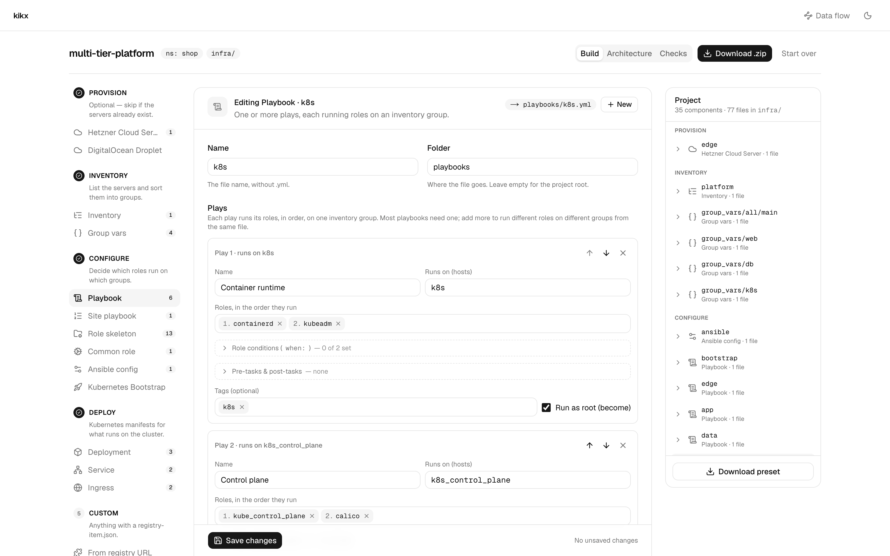
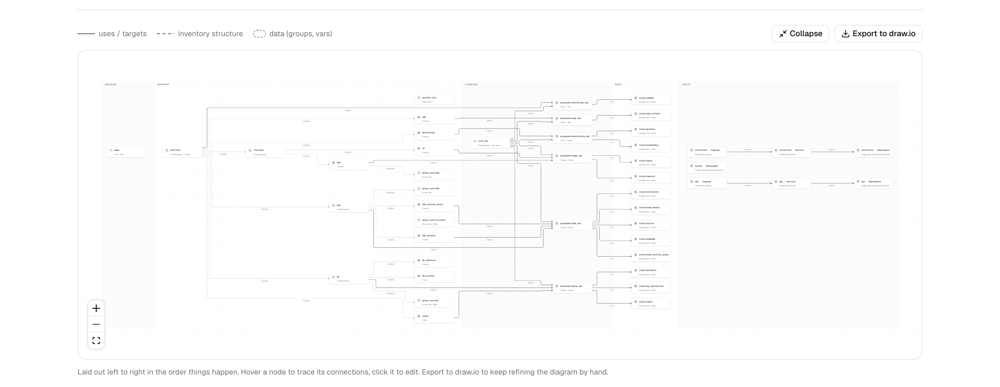

# Build an Ansible platform in the dashboard

In this tutorial you'll use the kikx dashboard to build a small Ansible project for a platform with
two web servers and a database server. You'll start from an inventory you already have, add group
vars, a playbook with two plays and a role condition, a site playbook and an Ansible config. Along
the way the dashboard will spot a mistake in the inventory; you'll fix it, let it scaffold the
missing roles, look at the architecture it draws, and download the result.

It takes about twenty minutes.

## Before you start

You need:

- a web browser;
- a terminal with [uv](https://docs.astral.sh/uv/), which you'll use to check the result with Ansible without installing it.

The last step also uses the `kikx` CLI. If you haven't installed it yet,
[Your first project with the CLI](first-project-cli.md) shows how.

## Open the dashboard

Open the kikx dashboard in your browser. You should see the kikx home page with a form headed
**Blank project**. Above it, **Start from a template** offers ready-made projects; in this
tutorial you'll start from an empty one instead.

To work on kikx itself with a local copy of the dashboard, see [Run kikx locally](../contributing/run-locally.md).

## Create the project

Fill in the form:

- **Project name**: `platform`
- **Default namespace**: leave it as `default`
- **Output directory**: `infra`

Click **Start building**.

You're now in the builder. It has three columns: the stages on the left (Provision, Inventory,
Configure, Deploy, Custom), the editor in the middle, and the **Project** panel on the right, which
says **Nothing yet. Most projects start with an Inventory.** Here is the same layout on a much
larger project:



Above the columns you see the project name, the badges `ns: default` and `infra/`, and three tabs:
**Build**, **Architecture** and **Checks**.

## Import an inventory

The editor already shows **New inventory**, and its **Name** field says `platform`. Instead of
typing the hosts one by one, you'll paste an existing inventory.

Next to **Hosts (1)**, click **Import inventory.ini**. A dialog titled **Import an existing
inventory** opens. Paste this into the text area:

```ini
[web]
web-01 ansible_host=192.0.2.10
web-02 ansible_host=192.0.2.11 ansible_user=root

[db]
db-01 ansible_host=198.51.100.20

[platform:children]
web
db

[platform:vars]
ansible_user=deploy
```

Under the text area the dialog counts **3 hosts · 3 groups**. Click **Replace hosts & groups**.

The dialog closes and the form fills in: **Hosts (3)** with `web-01`, `web-02` and `db-01`, and a
**Groups** section with `web`, `db` and `platform`. The `platform` row lists `web` and `db` as child
groups and `ansible_user=deploy` as its vars.

Scroll down to **Preview**. It shows `platform-inventory.ini`, rendered as you'd get it:

```ini
[web]
web-01 ansible_host=192.0.2.10
web-02 ansible_host=192.0.2.11 ansible_user=root

[db]
db-01 ansible_host=198.51.100.20

[platform:children]
web
db

[platform:vars]
ansible_user=deploy
```

Click **Add to project**. A notification says **Added platform**, and the **Project** panel now
lists `platform` under **Inventory**.

Notice two other things: the **Project** panel shows **1 warning** with a **Review** button, and
the **Checks** tab has a count of `1`. Leave that for now; you'll come back to it.

## Add group vars

The database servers need some nested settings. In the left column, under **Inventory**, click
**Group vars**. The editor switches to **New group vars**.

1. In **Group**, type `db`.
2. Tick **Folder layout** so the file becomes `group_vars/db/main.yml`.
3. Next to **Variables**, switch from **Key / value** to **YAML**.
4. Paste this into the text area:

   ```yaml
   postgres:
     version: 16
     max_connections: 200
     databases:
       - app
       - reports
   ```

The preview shows `group_vars/db/main.yml`:

```yaml
postgres:
  version: 16
  max_connections: 200
  databases:
    - app
    - reports
```

Click **Add to project**. The **Project** panel now has `group_vars/db/main` under **Inventory**.

## Add a playbook with two plays

In the left column, under **Configure**, click **Playbook**.

1. In **Name**, type `services`.
2. In **Folder**, type `playbooks`. The field shows `playbooks` in grey before you type; that's only
   a hint, so type it.

Fill in **Play 1**:

1. **Name**: `Web tier`
2. **Runs on (hosts)**: `web`
3. **Roles, in the order they run**: type `nginx` and press Enter. It becomes a numbered chip.

Click **Add play** and fill in **Play 2**:

1. **Name**: `Database tier`
2. **Runs on (hosts)**: `db`
3. **Roles, in the order they run**: type `postgres` and press Enter, then `backups` and press Enter.

Backups should be something you can switch off. Under Play 2, open **Role conditions (when:)**. It
lists one field per role. In the field next to `backups`, type:

```text
backups_enabled | default(true)
```

The preview shows `playbooks/services.yml`:

```yaml
- name: Web tier
  hosts: web
  become: true
  roles:
    - nginx

- name: Database tier
  hosts: db
  become: true
  roles:
    - postgres
    - role: backups
      when: backups_enabled | default(true)
```

Click **Add to project**. `services` appears in the **Project** panel under **Configure**.

## Add the site playbook

Under **Configure**, click **Site playbook**.

1. In **Name**, type `site`.
2. Under **Imports, in run order**, next to **from this project:**, click the
   `playbooks/services.yml` chip. A row appears with that path.
3. The row's name is filled in with the first play's name, `Web tier`. This import runs the whole
   playbook, so replace it with `Services`.

The preview shows `site.yml`:

```yaml
- name: Services
  import_playbook: playbooks/services.yml
```

Click **Add to project**. The **Project** panel now reads **4 components · 4 files in infra/**.

## Add an Ansible config

The playbook lives in `playbooks/`, and its roles will live in `roles/` at the top of `infra/`.
Ansible looks for roles next to the playbook, so it needs an `ansible.cfg` that points at them.

Under **Configure**, click **Ansible config**. The editor switches to **New ansible config**, and
**Name** already says `ansible`.

1. In **Inventory file**, type `platform-inventory.ini`. The field shows it in grey before you type;
   that's only a hint, so type it.
2. Leave **Roles path** as `roles`.

The preview shows `ansible.cfg`:

```ini
[defaults]
inventory = platform-inventory.ini
roles_path = roles
```

Click **Add to project**. The **Project** panel now reads **5 components · 5 files in infra/**.

## Fix the warning

Click the **Checks** tab. The page lists what kikx found when it cross-checked your components:

- under **Warnings**: **web-02 sets ansible_user=root, overriding [platform:vars]
  ansible_user=deploy**, with the explanation *Host vars win over group vars. Clear ansible_user on
  the host if the group value is the one you want.*
- under **Notes**: **services uses 3 roles kikx doesn't vendor**, listing `nginx, postgres,
  backups`.

The warning is right: the pasted inventory still had an old `ansible_user=root` on `web-02`, so it
would ignore the `deploy` user every other host uses. Fix it:

1. Next to the warning, click **Open platform**. You're back in the **Build** tab, in **Editing
   Inventory · platform**.
2. On the `web-02` row, open **Connection & host vars**. Its summary says **user root**.
3. Clear the **ssh user (inherit)** field.

In the preview, the `web-02` line loses its user:

```ini
web-02 ansible_host=192.0.2.11
```

Click **Save changes**. A notification says **Saved platform**. The warning count disappears from
the **Project** panel and from the **Checks** tab.

## Scaffold the roles

Click the **Checks** tab again. Only the note is left: **services uses 3 roles kikx doesn't
vendor**.

Click **Scaffold 3 roles**. A notification says **Scaffolded 3 roles**, and the page now reads:

```text
No conflicts found. Hosts, groups, playbooks and manifests all line up.
```

Click the **Build** tab. The **Project** panel lists `nginx`, `postgres` and `backups` under
**Configure**, each a **Role skeleton · 4 files**. Click the arrow next to `postgres` to see its
four files, and click `roles/postgres/tasks/main.yml` to read it:

```yaml
- name: Placeholder, replace with the real tasks for postgres
  ansible.builtin.debug:
    msg: "postgres ran on {{ inventory_hostname }}"
```

## Look at the architecture

Click the **Architecture** tab. kikx draws your project in swimlanes, left to right in the order
things happen: **Inventory**, **Playbooks**, **Roles**.

You should see:

- `ansible.cfg` (**roles_path: roles**) in the **Inventory** lane, with no edges;
- `platform` (**2 child groups**) with an **includes** edge to `web` (**2 hosts**) and one to `db`
  (**1 host**);
- `group_vars/db/main` with a **configures** edge to `db`;
- `playbooks/services.yml` (**2 plays · 3 roles**) with **targets** edges to `web` and `db`;
- `site.yml` with an **imports** edge to `playbooks/services.yml`;
- three **runs** edges from the playbook to `roles/nginx`, `roles/postgres` and `roles/backups`.

Hover a node to highlight its connections; click one to open it in the editor. On a larger project
the same view looks like this:



## Download the project

Click **Download .zip** at the top right. Your browser saves `platform.zip`. Unzip it into an empty
directory and look inside:

```bash
unzip platform.zip -d platform
cd platform
find . -type f | sort
```

```text
./infra/ansible.cfg
./infra/group_vars/db/main.yml
./infra/platform-inventory.ini
./infra/playbooks/services.yml
./infra/roles/backups/defaults/main.yml
./infra/roles/backups/handlers/main.yml
./infra/roles/backups/meta/main.yml
./infra/roles/backups/tasks/main.yml
./infra/roles/nginx/defaults/main.yml
./infra/roles/nginx/handlers/main.yml
./infra/roles/nginx/meta/main.yml
./infra/roles/nginx/tasks/main.yml
./infra/roles/postgres/defaults/main.yml
./infra/roles/postgres/handlers/main.yml
./infra/roles/postgres/meta/main.yml
./infra/roles/postgres/tasks/main.yml
./infra/site.yml
./kikx.toml
```

Nothing was written to your disk until now: the project lived in the browser tab.

Check that Ansible reads what you built. From `infra/`, ask it about `db-01`:

```bash
cd infra
uvx --from ansible-core ansible-inventory -i platform-inventory.ini --host db-01
```

```json
{
    "ansible_host": "198.51.100.20",
    "ansible_user": "deploy",
    "postgres": {
        "databases": [
            "app",
            "reports"
        ],
        "max_connections": 200,
        "version": 16
    }
}
```

The user comes from `[platform:vars]` and the settings from the group vars you pasted. Then check
the playbooks. `ansible.cfg` gives Ansible the inventory and the roles path, so no other option is
needed:

```bash
uvx --from ansible-core ansible-playbook site.yml --syntax-check
```

```text

playbook: site.yml
```

## Download the preset

Go back to the dashboard and the **Build** tab. At the bottom of the **Project** panel, click
**Download preset**. Your browser saves `platform.kikx-preset.json`, and the button is replaced by
two commands:

```text
kikx setup ./platform.kikx-preset.json
kikx apply ./platform.kikx-preset.json
```

The preset is the recipe for your project, not the files themselves. Rebuild the project from it
with the CLI, in a new empty directory that contains only the preset:

```bash
mkdir rebuilt
cd rebuilt
cp ~/Downloads/platform.kikx-preset.json .
kikx setup ./platform.kikx-preset.json
```

kikx lists the 17 files it wrote. The first line reads:

```text
Initialized kikx project `platform`: wrote 17 file(s) to …/rebuilt/infra
```

They're the same files as in the zip.

## What you've done

You imported an existing inventory, added YAML group vars in a folder layout, wrote a two-play
playbook with a role condition, wired it into `site.yml` and pointed Ansible at your roles with
`ansible.cfg`. The Checks view caught a host var silently overriding a group var; you fixed it and
scaffolded the three roles the playbook needed.
You saw the architecture kikx drew from your components, downloaded the project as a zip that
Ansible accepts, and rebuilt it from a preset with the CLI.

When you want to go further:

- bring your own inventory: [Import an existing Ansible inventory](../how-to/import-an-inventory.md);
- more plays, pre-tasks and post-tasks: [Write a multi-play playbook with role conditions](../how-to/multi-play-playbooks.md);
- every check and what triggers it: [Checks reference](../reference/checks.md);
- keep refining the diagram by hand: [Export the architecture to draw.io](../how-to/export-to-drawio.md);
- `setup` versus `apply`: [Share a project as a preset](../how-to/presets.md);
- start from a ready-made project instead of an empty page: [Start from a template](../how-to/presets.md#start-from-a-template);
- how the edges are chosen: [How the architecture diagram is drawn](../explanation/architecture-diagram.md).
